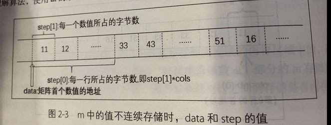
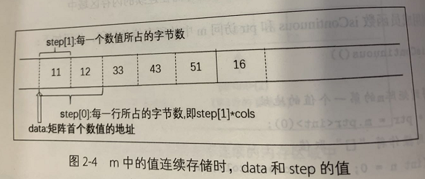

# OpenCV 3.x 学习笔记

## 二、图像数字化

### 2.1 构造nd array对象

OpenCV的python的API是基于numpy的，所以使用n维数组时，需要在开头

```python
    import numpy
```

ndarry 代指 N 维数组，

二维数组([0, 0, 0],

&emsp;&emsp;&emsp;&emsp;[1, 1, 1]])

三维数组 每个元素都是一个二维数组

```python
    ([[0, 0, 0,]
     [1, 1, 1]],
     [[0, 0, 0,]
     [1, 1, 1]],
     [[0, 0, 0,]
     [1, 1, 1]])
```

**切片**  

在python列表使用的[切片](https://www.jb51.net/article/130946.htm)在这里同时适用。  
m[r, c]  
&emsp;**r** 代表是数组的第几行，从0开始  
&emsp;**c** 代表是数组的第几列，从0开始  

**数组中的切片介绍**  

m[2, :] 代表输出第1行的所有数据  
同理 m[:, 3] 代表输出第3列的所有数据  
[实现代码](code/numpy_01.py)  
三维数组中还有一种这样的切片

m[:, :, 0] 是代表获取m中所有二维数组的第0列

同理，要是0在前面，是代表所有二维数组的第0行

查看数组的行数和列数

```m.shape```

查看类型

```m.dtype```

### 2.2 认识 OpenCV 中的 Mat 类

#### 2.2.2 构造单通道Mat对象
Mat 是代表矩阵或者数组的意思  

需要引入头文件，头文件**opencv2\core\core.hpp**  

构造 Mat 包含四个要素，行（高）数，列（宽）数，通道数和数据类型 
**Mat(int rows, int cols, int type)**  

**为什么四个要素只有三个参数？是因为type 包含了通道数和数据类型。**  
rows 行数，或者高  
cols 列数，或者宽  
type，通道数和数据类型可以设置为以下类型  
&emsp;&emsp;&emsp;CV_8UC(n), CV_8SC(n),CV_16SC(n),CV_16UC(n),CV_32SC(n),CV_32FC(n),CV_64FC(n)  
&emsp;&emsp;&emsp;其中8U，8S等前面数字的代表Mat中每一个数值所占的bit数,
**1byte=8bit**，一个字节等于8比特。  
&emsp;&emsp;&emsp;32F是占4字节的float类型，64F是占8字节的double类型，32S是占4字节的int类型，8U是占一个字节的uchar类型，其他类似。  
&emsp;&emsp;&emsp;C(n)代表通道数，  
&emsp;&emsp;&emsp;&emsp;&emsp;&emsp;n=1；即构造单通道矩阵或者称二维矩阵  
&emsp;&emsp;&emsp;&emsp;&emsp;&emsp;n>1; 即构造多通道矩阵或者即三维矩阵，直观上就是n个二维矩阵组成的三维矩阵    
&emsp;&emsp;&emsp;&emsp;&emsp;&emsp;单通道矩阵和二维ndarray是等价的，多通道矩阵和三维ndarray是等价的  
还可以这样构造一个Mat  
**Mat(Size(int cols, int rows), int type)**  
Size 是OpenCV中的一个类，该类一般用于存储举证的列数和行数，*需要注意第一个是列宽，第二个参数是行高，即先春宽，再存高，正好与ndarray的shape相反。  

#### 2.2.3 访问单通道Mat的基本信息  

**m.rows()** **m.cols()** 是获取矩阵的行数和列数  
**m.size()** 是获取矩阵的尺寸，输出是一个[row\*col]的数据，例如[2\*3]  
**m.channels()** 是获取矩阵的通道数  
**m.total()** 是获取矩阵的面积 例如两行三列的矩阵，面积就是2*3=6   
**m.dims()** 是获取矩阵的维数，如果是二维矩阵，输出就为2，同理，三维矩阵，为3  

#### 2.2.4 访问Mat 中对象的值

##### 1)at  获取行和列的数值

用法 m.at<数据类型>(r,c) 行数和列数  
也可以 另一种方式  引用Opencv 中point类， 用法 m.at<数据类型>(Point(c,r));  

##### 2)ptr   在内存中读取Mat中的数值

 一般用 ptr 获取每行，第一个数据的首地址， 用法m.ptr\<int>(r);  

##### 3）isContinuous 和 ptr

 当 isContinuous  返回为true时，则代表行与行之间是连续存储的  
 主要适用于在判断里，然后循环打出矩阵中的所有数值  

##### 4）step 和data

step[0] 每一行所占的字节数  
分两种情况 1;行与行之间存在相同的内存间隔  

  

2;行与行之间存在连续的间隔  



step[1] 每个数值所占字节数  
step[0] 就等于 step[1]\*cols  
data 是指向第一个数值的指针，类型为uchar  
用法  \*((int*)(m.data+m.steo[0]\*r+c*m.step[1]))  
总结， at是最慢的，但是可读性很高  

#### 2.2.5 向量类Vec

向量类可以理解为在数学意义上的一个[列向量](https://baike.baidu.com/item/%E5%88%97%E5%90%91%E9%87%8F/6247956?fr=aladdin).  
构造一个_cn*1 的列向量，数据类型为_TP 的格式如下：

```C++
    Vec<Typename _TP, int _cn>
```

例：构造一个长度为3，数据类型为int，且初始化为21， 32， 14 的列向量，代码如下：

```C++
    Vec<int, 3>vi(21, 32, 14)
    /* 解释
    vi 代表 矩阵的名字
    */
```

Vec 也可以使用[ ] ( ) 操作符，访问向量中的值，实例  
vi[0]   C++ cout << "访问第0个元素" << vi[0] << endl;  
vi(2)   C++ cout << "访问第2个元素" << vi(2) << endl;  

OpenCV 为向量类的声明取了一个别名，例如：  
typedef Vec<uchar, 3> Vec3b;  
typedef Vec<int, 2> Vec2i;  
typedef Vec<float, 4> Vec4f;  
typedef Vec<double, 3> Vec3d;  
可以查看头文件< opencv2/core/core.hpp >

**单通道矩阵的每一个元素都是一个数值，多通道矩阵的每一个元素都可以看作一个向量。**  

#### 2.2.6 构造多通道Mat对象

格式：

```c++
    Mat(int rows, int cols, CV_32FC(n))
```

例 构造一个2行2列的float类型的三通道矩阵，代码如下：

```c++
    Mat mm =(Mat<Vec3f>(2, 2)<<Vec3f(1,2,3), Vec3f(4,5,6),
                               Vec3f(11,22,33), Vec3f(44,55,66))
```

#### 2.2.7 访问多通道Mat对象中的值

1. at 单通道访问的是一个数值，多通道访问的是一个向量
2. ptr 访问多通道的指针，输出结果也是一个向量值
3. isContinuous 和 ptr 通过判断行与行之前是否连续存储，连续存储就可以一个循环就搞定遍历元素  
4. step 和data 同单通道  
[实现代码](code/step_data.cpp)  
5. 分离通道： 将多通道矩阵分离成单通道  
原理： 将所有向量的第一个值组成的单矩阵作为第一个通道  
&emsp;&emsp; 第二值，第二个通道，以此类推  
格式：（单通道矩阵被存放在Vector容器中）  
 &emsp;&emsp;Vector<Mat> planes;  在容器内建立planes 存放矩阵的空间  
&emsp;&emsp;split(mm, planes);     分隔名叫mm的多矩阵到planes中  
6. 合并通道  
条件：多个具有相同的尺寸，数据类型的单通道矩阵  
使用merge函数，将多个单通道合并一个三维矩阵，声明如下：  
&emsp;&emsp;void merge(const Mat*mv, size_t count, OutputArray dst)  
代码：  
&emsp;&emsp;先创建三个单通道矩阵  
&emsp;&emsp;合并成数组 Mat plane[] ={plane0， plane1，plane2}；  


    &emsp;&emsp;Mat  mat;  
&emsp;&emsp;meger(plane,3,mat)  

#### 2.2.8 获得Mat中某一区域的值

1. 使用成员函数row(i)和col(j)得到矩阵的第i行第j列  

```C++
    int r = 1;
    int c = 0;
    //矩阵的第r行
    Mat mr = m.row(r);
    //获取矩阵的第c列
    Mat mc = m.col(c);
```

2. 使用成员函数rowRange和colRange 得到矩阵的连续行和连续列  
这是基于Opncv中的Range类，该类用于构造连续的整数序列，构造如下：  
     Range(int _start, int _end)  
     这是一个左闭右开的序列[_start, _end),和python中的range的函数相同，例，Range(2,5)其实产生的是2、3、4、的序列。  
3. 使用成员函数clone和copyTo
 clone: 是将矩阵克隆一份，在克隆的矩阵中更改数值  
 copyTo：是将矩阵复制一份，在复制的矩阵中更改数值  
 以上两种方式都是不会更改原矩阵的数值

 ```C++
    Mat r_range = matrix.rowRange(2, 4).clone();
    // 即将matrix的第2,3 行克隆一份，这时候只改变r_range的值。  
    //同理，也可以使用copyTo  
    Mat r_range;
    matrix.rowRange(2, 4).copyTo(r_range);
```

4. 使用Rect类  
三种构造方式：  
&emsp;Rect(int_x, int_y, int_width,int_hight) 左上角坐标，还有矩形的宽高  
&emsp;Rect(int_x, int_y, Size size) 知道左上角坐标，将宽高保存到一个Size中  
&emsp;Rect(Point2i &pt1,Point2i &pt2) 知道左上角和右下角的坐标，构造一个矩形  

```C++
    //左上角坐标和右上角坐标
    Mat roi1 = matrix(Rect(Point(2,1),Point(3,2)));
    // x,y,宽度，高度
    Mat roi2 = matrix(Rect(2,2,1,3));
    // 左上角坐标，尺寸
    Mat roi1 = matrix(Rect(2,3),Size(2,2));
```

&emsp;&emsp;&emsp;以上也可以使用clone和copyTo对这个区域的矩阵数值进行修改。当然也可以使用colRange和rowRange，进行修改这个区域内的矩阵数值。  

### 2.3 矩阵的运算

#### 2.3.1 加法运算

1. Mat 的加法  
条件：两个矩阵的数据类型必须一致。  
可以直接使用 **+** 符号，进行直接运算，同行同列的数相加,当然也可以与数值相加  
但是要注意字符类型的范围，若是uchar类型，它的范围是(0-255) 超过255的值会默认为输出255，这个叫做截断。  
**为了解决不同类型的矩阵相加减，opencv提供了一个名叫“add”的函数  

```c++
    void add(InputArray src1, InputArray src2, OutputArray dst, InputArray mask=noArray(), int dtype=-1)
```

2.ndarray 加法   
如果使用 **+** 的办法，也还是需要保证相同的数据类型才可以正常，否则会报错。  
[python的实现代码](code/ndarray_add.py)
